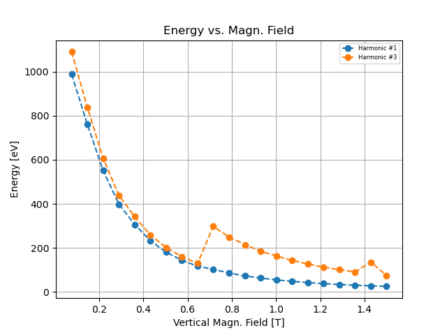

# profile_sirepo_ari

## Start

Prepare the environment by following the instructions at
https://nsls-ii.github.io/sirepo-bluesky/installation.html.

We are using simulation with sim_id=`00000004`. See
https://nsls-ii.github.io/sirepo-bluesky/simulations.html for more details.

```bash
$ conda activate <conda-env>  # with sirepo-bluesky, bluesky, ophyd, databroker, etc.
$ pip install -r requirements.txt  # additional packages, not listed in the requirements.
$ git clone https://github.com/NSLS-II-ARI/profile_sirepo_ari && cd profile_sirepo_ari/
$ USE_SIREPO=yes ipython --profile-dir=.
```

## Run a scan

```python
uid, = RE(scan_spectra_vs_mag_field())
```

## Export data

```python
hdr = db[uid]
tbl = hdr.table(fill=True)
tbl.to_json("data/scan-spectra-vs-und-magn-field.json")
```

## Load data

```python
import pandas as pd
df = pd.read_json("data/scan-spectra-vs-und-magn-field.json")
```

## Find peaks

### Prepare the axis

```python
import matplotlib.pyplot as plt
fig, ax = plt.subplots(nrows=1, ncols=1)
```

### From databroker header

```python
lookup_harm1 = find_peaks(tbl, harm_num=0, ax=ax)  # harmonic #1 (counting starts from 0)
```

Output:
```
energy[idx][harm_num] =  988.855 [eV]  intensity[idx][harm_num] = 1.86084e+12 [arb.u.]  mag_field = 0.075 [T]
energy[idx][harm_num] =  760.511 [eV]  intensity[idx][harm_num] = 3.55522e+12 [arb.u.]  mag_field = 0.146 [T]
energy[idx][harm_num] =  551.426 [eV]  intensity[idx][harm_num] = 3.41183e+12 [arb.u.]  mag_field = 0.218 [T]
energy[idx][harm_num] =  398.463 [eV]  intensity[idx][harm_num] = 2.67658e+12 [arb.u.]  mag_field = 0.289 [T]
energy[idx][harm_num] =  306.575 [eV]  intensity[idx][harm_num] = 6.49043e+12 [arb.u.]  mag_field = 0.360 [T]
energy[idx][harm_num] =  232.295 [eV]  intensity[idx][harm_num] = 4.96109e+12 [arb.u.]  mag_field = 0.431 [T]
energy[idx][harm_num] =  180.574 [eV]  intensity[idx][harm_num] = 3.84862e+12 [arb.u.]  mag_field = 0.503 [T]
energy[idx][harm_num] =  143.709 [eV]  intensity[idx][harm_num] = 3.04896e+12 [arb.u.]  mag_field = 0.574 [T]
energy[idx][harm_num] =  116.748 [eV]  intensity[idx][harm_num] = 2.47069e+12 [arb.u.]  mag_field = 0.645 [T]
energy[idx][harm_num] =  102.442 [eV]  intensity[idx][harm_num] = 5.31988e+13 [arb.u.]  mag_field = 0.716 [T]
energy[idx][harm_num] =   85.935 [eV]  intensity[idx][harm_num] = 4.49826e+13 [arb.u.]  mag_field = 0.788 [T]
energy[idx][harm_num] =   72.730 [eV]  intensity[idx][harm_num] = 3.78259e+13 [arb.u.]  mag_field = 0.859 [T]
energy[idx][harm_num] =   62.826 [eV]  intensity[idx][harm_num] = 3.31022e+13 [arb.u.]  mag_field = 0.930 [T]
energy[idx][harm_num] =   54.572 [eV]  intensity[idx][harm_num] = 2.88076e+13 [arb.u.]  mag_field = 1.001 [T]
energy[idx][harm_num] =   47.970 [eV]  intensity[idx][harm_num] = 2.45009e+13 [arb.u.]  mag_field = 1.073 [T]
energy[idx][harm_num] =   42.467 [eV]  intensity[idx][harm_num] = 2.06577e+13 [arb.u.]  mag_field = 1.144 [T]
energy[idx][harm_num] =   37.515 [eV]  intensity[idx][harm_num] = 1.98167e+13 [arb.u.]  mag_field = 1.215 [T]
energy[idx][harm_num] =   33.664 [eV]  intensity[idx][harm_num] = 1.7762e+13 [arb.u.]  mag_field = 1.286 [T]
energy[idx][harm_num] =   30.362 [eV]  intensity[idx][harm_num] = 1.56421e+13 [arb.u.]  mag_field = 1.358 [T]
energy[idx][harm_num] =   27.611 [eV]  intensity[idx][harm_num] = 1.25028e+13 [arb.u.]  mag_field = 1.429 [T]
energy[idx][harm_num] =   24.860 [eV]  intensity[idx][harm_num] = 1.29954e+13 [arb.u.]  mag_field = 1.500 [T]
```

### From loaded dataset

```python
lookup_harm3 = find_peaks(df, harm_num=2, ax=ax)  # harmonic #3 (counting starts from 0)
```

Output:
```
energy[idx][harm_num] = 1090.096 [eV]  intensity[idx][harm_num] = 1.20667e+14 [arb.u.]  mag_field = 0.075 [T]
energy[idx][harm_num] =  838.093 [eV]  intensity[idx][harm_num] = 2.42162e+14 [arb.u.]  mag_field = 0.146 [T]
energy[idx][harm_num] =  607.549 [eV]  intensity[idx][harm_num] = 2.48905e+14 [arb.u.]  mag_field = 0.217 [T]
energy[idx][harm_num] =  439.180 [eV]  intensity[idx][harm_num] = 2.06994e+14 [arb.u.]  mag_field = 0.289 [T]
energy[idx][harm_num] =  341.790 [eV]  intensity[idx][harm_num] = 8.86803e+12 [arb.u.]  mag_field = 0.360 [T]
energy[idx][harm_num] =  258.706 [eV]  intensity[idx][harm_num] = 7.0522e+12 [arb.u.]  mag_field = 0.431 [T]
energy[idx][harm_num] =  201.482 [eV]  intensity[idx][harm_num] = 5.60434e+12 [arb.u.]  mag_field = 0.503 [T]
energy[idx][harm_num] =  160.216 [eV]  intensity[idx][harm_num] = 4.54954e+12 [arb.u.]  mag_field = 0.574 [T]
energy[idx][harm_num] =  129.953 [eV]  intensity[idx][harm_num] = 3.62772e+12 [arb.u.]  mag_field = 0.645 [T]
energy[idx][harm_num] =  297.222 [eV]  intensity[idx][harm_num] = 2.29988e+12 [arb.u.]  mag_field = 0.716 [T]
energy[idx][harm_num] =  249.352 [eV]  intensity[idx][harm_num] = 1.94845e+12 [arb.u.]  mag_field = 0.788 [T]
energy[idx][harm_num] =  214.688 [eV]  intensity[idx][harm_num] = 4.12533e+12 [arb.u.]  mag_field = 0.859 [T]
energy[idx][harm_num] =  184.976 [eV]  intensity[idx][harm_num] = 3.39043e+12 [arb.u.]  mag_field = 0.930 [T]
energy[idx][harm_num] =  163.517 [eV]  intensity[idx][harm_num] = 5.99787e+13 [arb.u.]  mag_field = 1.001 [T]
energy[idx][harm_num] =  143.159 [eV]  intensity[idx][harm_num] = 5.28474e+13 [arb.u.]  mag_field = 1.073 [T]
energy[idx][harm_num] =  126.652 [eV]  intensity[idx][harm_num] = 4.64345e+13 [arb.u.]  mag_field = 1.144 [T]
energy[idx][harm_num] =  112.346 [eV]  intensity[idx][harm_num] = 3.79193e+13 [arb.u.]  mag_field = 1.215 [T]
energy[idx][harm_num] =  100.791 [eV]  intensity[idx][harm_num] = 3.76312e+13 [arb.u.]  mag_field = 1.286 [T]
energy[idx][harm_num] =   90.887 [eV]  intensity[idx][harm_num] = 3.21205e+13 [arb.u.]  mag_field = 1.357 [T]
energy[idx][harm_num] =  135.455 [eV]  intensity[idx][harm_num] = 2.62935e+12 [arb.u.]  mag_field = 1.429 [T]
energy[idx][harm_num] =   74.931 [eV]  intensity[idx][harm_num] = 2.06015e+13 [arb.u.]  mag_field = 1.500 [T]
```

### Plots



### Export lookup tables

```python
lookup_harm1.to_csv("data/harmonic1.csv")
lookup_harm3.to_csv("data/harmonic3.csv")
```

### Get peaks for all spectra

```python
plot_all_peaks(df, method="peakutils", thres=0.05, filter_thres=0.20)
plot_all_peaks(df, method="peakutils", thres=0.07, filter_thres=0.20)
plot_all_peaks(df, method="peakutils", thres=0.10, filter_thres=0.20)

plot_all_peaks(df, method="scipy", thres=0.05, filter_thres=0.20)
plot_all_peaks(df, method="scipy", thres=0.07, filter_thres=0.20)
plot_all_peaks(df, method="scipy", thres=0.10, filter_thres=0.20)
```

### Threshold 5%


### Threshold 7%


### Threshold 10%


